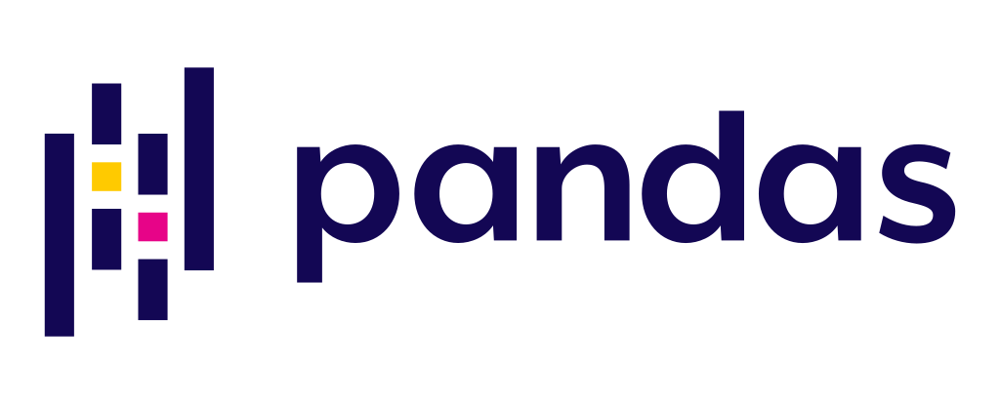

<h3> 🌱 I’m currently learning </h3>
 
<li> 💻 Stanford CS101 - Introduction to Computing Principles</li>
<li>🚀 Graphql & Apollo</li>
<li>👩🏻‍💻 QA engineer essentials</li>
<li>🙏 Yale University - The Science of Well-Being</li>
<li>💩 LITO Academy</li>

 
 :coffee: Something is brewing...
 
  

<h2> ⚡ Stacks </h2>

                  

 
 

<!-- Here are some ideas to get you started: 🔭 I’m currently working on ... -->

<!-- - 👯 I’m looking to collaborate on ...
- 🤔 I’m looking for help with ...
- 💬 Ask me about ...⚡k⚡⚡k⚡⚡⚡kk
- 📫 How to reach me: ...
- 😄 Pronouns: ...
- ⚡ Fun fact: ... -->
